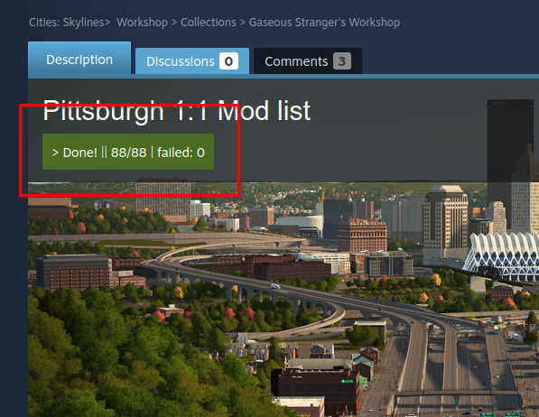

# Steam workshop downloader

## ⚠️ $\textcolor{red}{\textsf{This script no longer works}}$ ⚠️

## [Get the script ↡](https://greasyfork.org/en/scripts/458567-steam-collection-downloader)

A simple userscript that downloads mods and mod collections from the steam workshop.

A few notes:

-   It takes some time for the download to begin.
-   If it stops near the end wait a few seconds/minutes.
-   It should take at most 2 minutes to download around 100 items.
-   Almost all Cities: Skylines mods are downloadable. Some more popular mods for other games are available but less popular ones may not be.

A huge thanks to the folks at [smods.ru](https://smods.ru/) and [steamworkshop.download](http://steamworkshop.download/). They are the ones who provide all the mod downloads <3

Please [report](https://github.com/cappig/steam-workshop-downloader/issues) any bugs.

 

have fun :)
